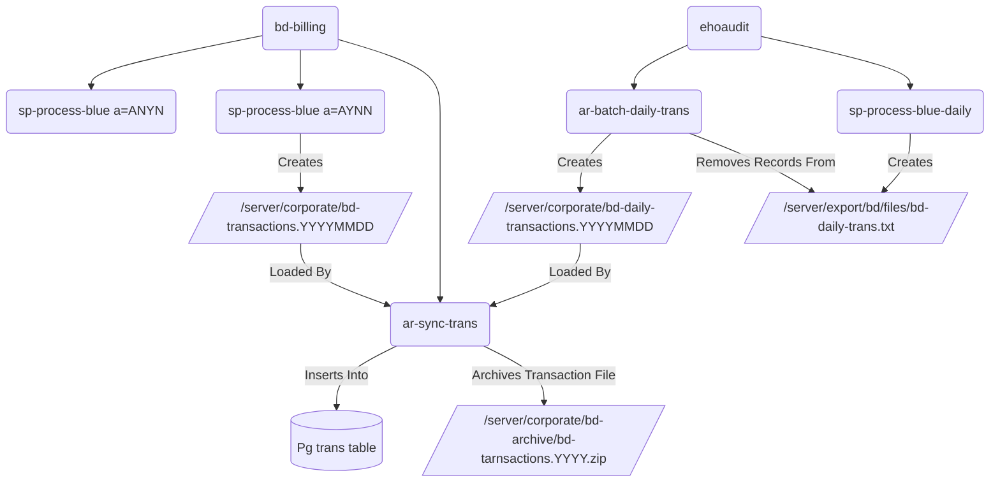

# CPS Blue Diamond Backend System

## Dependencies

- python-pexpect
- python-beaker
- python-psycopg2
- paramiko >= 1.7.7.1
- pycrypto >= 2.5
- requests                            0.14.2 version developed with
- reportlab >= 2.4
- python-webob >= 1.1.1

# Batch Billing Process Diagram

